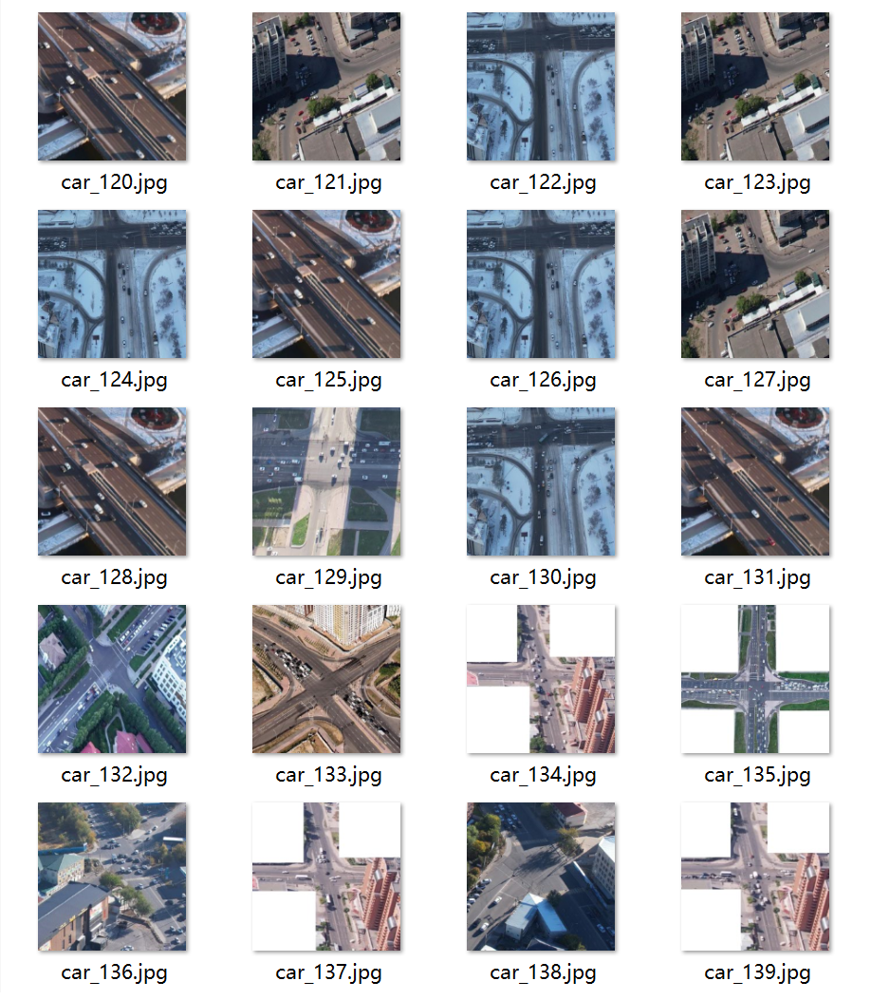
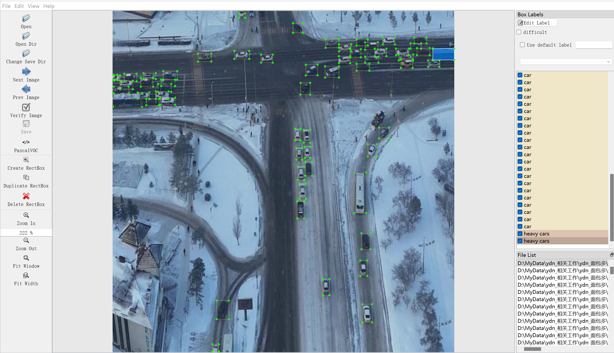

# Remote Sensing Image Vehicle Detection - Target Detection Dataset

Dataset Information Introduction: A total of 1035 images and corresponding annotation files are available. 
Annotation files are provided in two formats, including VOC formatted XML files and YOLO formatted TXT files. 
The objects annotated include the following: ['car', 'heavy cars']
The number of bounding box annotations is as follows: (Annotations are typically labeled in English, with Chinese provided in parentheses for reference)
Note: An image may contain multiple objects, so the total number of bounding box annotations may be greater than the number of images.
The complete dataset includes three folders and one txt file:
all_images file: Stores the dataset's images, screenshots included:
Image size information:
all_txt folder and classes.txt: Stores the YOLO formatted TXT annotation files, in the same quantity as the images, each annotation file corresponds to an individual image.
classes.txt:
For a detailed understanding of the YOLO format standard files, please search on your own. In short, the number 0 represents the name at the position 0 in the array in classes.txt.
all_xml file: VOC formatted XML annotation file.
The quantity and images are the same, each annotation file corresponds to an individual image.
For a detailed understanding of the VOC format standard files, please search on your own.
Both formats of annotation are available and can be used whichever one you choose.
Annotation effect screenshots included:

## Images

Here is a pay link on Stripe ( https://buy.stripe.com/3cs8yP7sY87d0vu9AB ). Please contact me lonlonago@foxmail.com after funding $89, and I will send you a complete data files , thank you!

